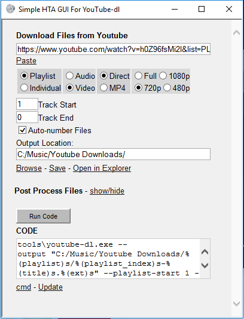

# README

This is a simple HTA GUI for YouTube-dl. This will only run on Windows as far as I know.

## Installation

Put SimpleHTAGUI.hta into a folder. Create a new folder in that location and name it "tools"
In the tools folder place the required executables.

The tools folder should contain the following tools:

youtube-dl https://youtube-dl.org/

ffmpeg https://ffmpeg.org/download.html

id3.exe (optional) https://squell.github.io/id3/#getting-it

mp3split.exe (optional) http://mp3splt.sourceforge.net/mp3splt_page/downloads.php

## Usage

Find an online video that you want to download and copy its URL to the clipboard.

Open Simple HTA GUI for YoutTube-dl (double click on SimpleHtaGui.hta).

If the video is a youtube video, the URL should automatically poplulate the URL text field when starting the script.

Click on the Paste link if there is no URL in the URL text field.

Choose if you want a playlist or individual file.

Choose if you want Audio or Video (Video includes audio).

Choose if you want to convert the file to MP4 (not recommended)

Choose what resolution you want, youtube-dl will try to get closest available resolution not exceeding the number specified.

Select your Output Location by typing or clicking on browse.

It's recommended that you click save. (This setting is saved in a text file in the same folder as SimpleHTAGUI.hta).

Next click "Run Code"

A youtube-dl.exe window should open up and display information about the video(s) and its current progress.

Post processing is confusing and I need help with this workflow.

Click show/hide

Choose which folder that you want to process. If you downloaded a playlist, you'll want to browse to that folder.

Click Trim Silence to remove silence from the beginning and end of each mp3 file. Then click the Run Code Button. Trim Silence is useful because it's common for people to add their own comments and text at the beginning of the songs that they upload.

Please keep in mind that mp3splt.exe creates a folder called "trimmed" and puts the trimmed mp3s there. You will have to manually delete the original files and move the trimmed files to the correct folder. I need help with this. I tried various mp3splt.exe switches but never had any luck getting the mp3s trimmed in place.

Clicking Set Tags will give you two optional text fields for Artist and Album. Fill those out and click on the Run Code button.

Rename to mp4 is a simple file extension rename. It will rename webm and mkv files to mp4 (click Run Code to run it). The MP4 extension seems less confusing for Windows to figure out what to do with it.

I added titles to most of my HTML so mousing over should provide some extra information if things don't make sense.
Clicking in the CODE textarea will copy that text to your clipboard. This can be useful for troubleshooting.
